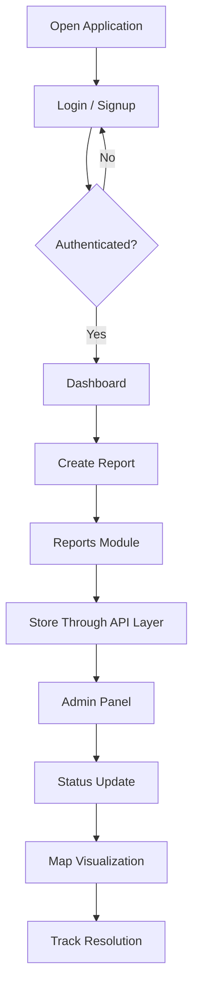
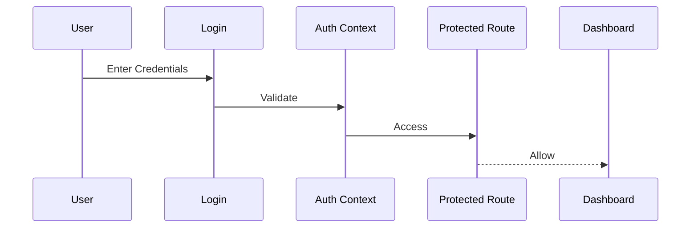
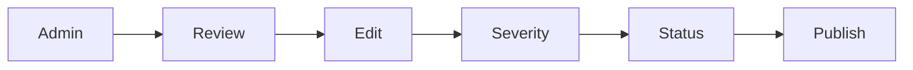
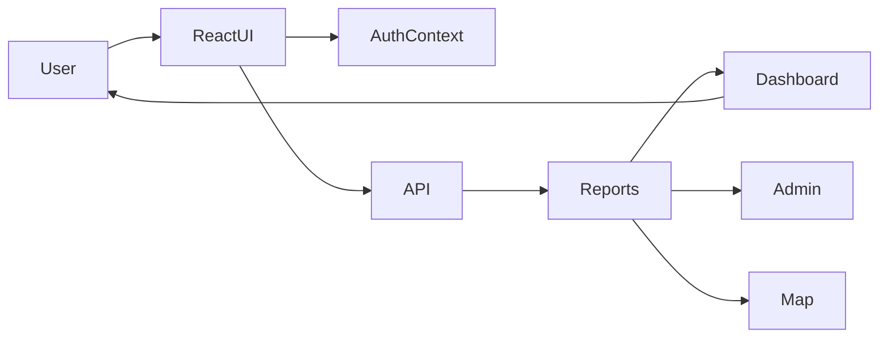

# 🚀 UrbanLens – CityGuard

> A modern Smart City Monitoring & Issue Reporting platform built using React + Vite.

## 🌍 Problem Statement
Urban issues such as theft alerts, drainage failures, street-light outages, and climate-related incidents are difficult to track centrally.

UrbanLens provides a digital platform where citizens can report incidents and authorities can monitor and resolve them.

---

# ✨ Features

## Citizen Features
- User Registration & Login
- Dashboard with analytics
- Create issue reports
- Browse submitted reports
- Interactive map monitoring
- Track resolution status

## Admin Features
- Protected admin access
- Update report status
- Add admin notes
- Manage severity levels
- Monitor overall activity

---

# 🛠 Tech Stack

Frontend:
- React 18
- Vite
- React Router DOM
- Axios
- Tailwind CSS
- Recharts
- Leaflet + React Leaflet

---

# 📂 Project Structure

```text
src
├── components
│   ├── Auth
│   │   ├── Login.jsx
│   │   └── Signup.jsx
│   ├── Dashboard
│   ├── Reports
│   ├── Map
│   ├── Admin
│   └── Layout
├── context
├── utils
├── App.jsx
└── main.jsx
```

---

# 🔄 End‑to‑End Application Flow



---

# 🔐 Authentication Flow



---

# 🧭 Navigation Flow

Dashboard →
Report Issue →
Reports →
Map →
Admin

---

# 📊 Dashboard Module

Displays:
- KPI cards
- Report distribution
- Charts
- Status tracking
- Recent activity

Detected categories:
- Theft
- Drainage
- Street Light
- Climate

Detected statuses:
- Pending
- In Progress
- Resolved

---

# 🗺 Map Monitoring

Uses Leaflet.

Capabilities:
- Geo markers
- Popup details
- Filters
- Auto zoom
- Severity visibility

---

# 👨‍💼 Admin Workflow



---

# 🏗 System Architecture



---

# ⚙ Installation

```bash
npm install
npm run dev
```

Run:

```bash
http://localhost:5173
```

---

# 🚀 Future Scope

- AI incident prioritization
- Image uploads
- Real‑time notifications
- Heatmap analytics
- Mobile application
- Predictive monitoring

---

# 💡 Conclusion

UrbanLens combines analytics, mapping, reporting, and administrative control into one unified city intelligence dashboard.
